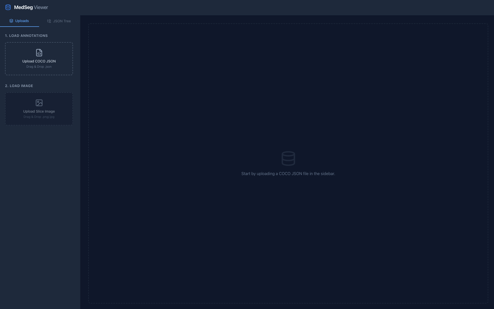
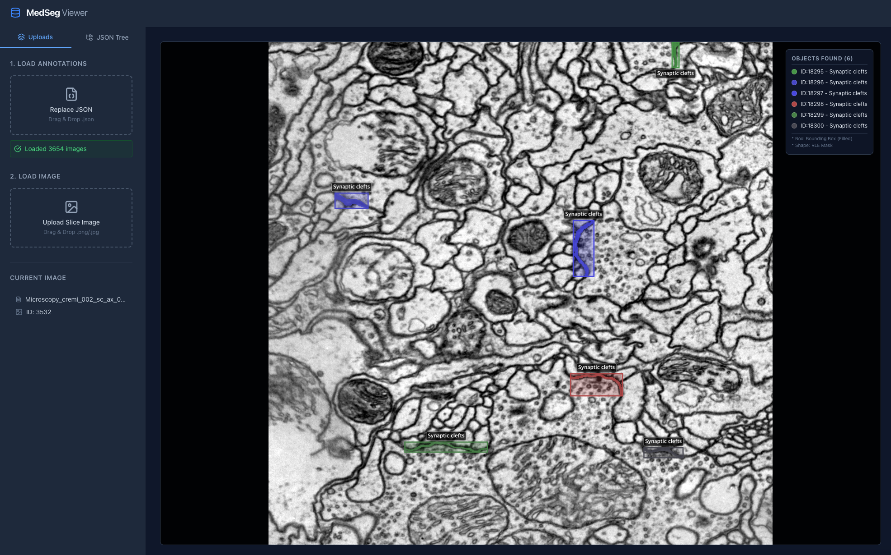

# MedSeg-Viewer
This app is entirely coded by Gemini 3 Pro.
## How to use?

After running this app, you can see this page.  
First, you can upload your json file (COCO format) of the image dataset, and you can upload the data.  

In side this app, we match the base name of the file name in annotation and the file name of the attached image. Please align them.

After providing the annotation file and image file, then you can see this visualization. If there is the bounding box information, bbox would be visualized too.

Also, you can see the structure of the JSON in the JSONtree tab.  
In our case, the file name in annotation is constructed as "Modality/dataset name/file name".  
I constructed this hierarchies as tree structure. With this visualization, we can explore the brief statistics of the dataset. 

## Run Locally

**Prerequisites:**  Node.js

1. Install dependencies:
   `npm install`
2. Run the app:
   `npm run dev`
